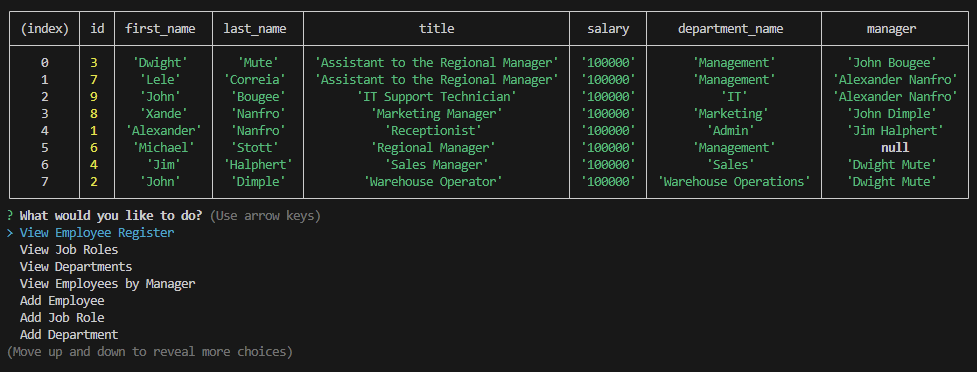

# Dunder Nifflin CMS



## Description
This project was the week 13/module 12 challenge focusing on using MySQL in conjunction with node.js.  The challenge was to create a CMS (Content Management System). I found this challenge the most challenging for quite a while; mostly because there's a few different syntaxes in play, trying to understand the capabilities of MySQL but also trying to connect it with node.js at the same time.  I had it mostly ready by the due date, but asked for a 3 day extension so I could work on refactoring my code a bit, and write a decent readme.  If you delve into my code, you will see I've written code in JS that a SQL query can do for you with a simple statement, but I was unaware at the time, and have only found this at the end.  For example:  It took me a bit of tinkering to understand how to use a self-join to show the "manager" in the "View Employee Register" table, and soon after that I realised I could have solved a lot of JS problems with some simple MySQL!

In the end I was really proud of how I set up my HTTP request routes, I feel I kept it really clean by modulating the files and keeping the functions in a separate file.  I also think I could have cleaned up the inquirer code in my index.js, and used more functions to make the fetch requests, at this stage I just don't have the time to continue refactoring code which kills me on the inside a little... I guess this would be a real challenge in a commercial setting with deadlines!

In this challenge there were a few bonus items that could be completed; I incorporated two of them into my application (Update employee managers, View employees by manager), and the others I wrote the queries in /db/query.sql to prove to myself that I could actually do them.  I have full confidence that I have the ability to incorporate them into this application.

The acceptance criteria of this project were as follows:

```md
GIVEN a command-line application that accepts user input
WHEN I start the application
THEN I am presented with the following options: view all departments, view all roles, view all employees, add a department, add a role, add an employee, and update an employee role
WHEN I choose to view all departments
THEN I am presented with a formatted table showing department names and department ids
WHEN I choose to view all roles
THEN I am presented with the job title, role id, the department that role belongs to, and the salary for that role
WHEN I choose to view all employees
THEN I am presented with a formatted table showing employee data, including employee ids, first names, last names, job titles, departments, salaries, and managers that the employees report to
WHEN I choose to add a department
THEN I am prompted to enter the name of the department and that department is added to the database
WHEN I choose to add a role
THEN I am prompted to enter the name, salary, and department for the role and that role is added to the database
WHEN I choose to add an employee
THEN I am prompted to enter the employee’s first name, last name, role, and manager, and that employee is added to the database
WHEN I choose to update an employee role
THEN I am prompted to select an employee to update and their new role and this information is updated in the database
```

## Table of Contents

1. [Installation](#installation)
2. [Application Walkthrough](#application-walkthrough)
3. [Usage](#usage)
4. [License](#license)
5. [Contribution](#contribution)
6. [Questions](#questions)

## Installation
Run the server.js to initiate the server, then run index.js to begin using the application.

## Application Walkthrough
The walkthrough can be seen at the following link: <https://drive.google.com/file/d/11DfbrRNrYy-hvWaXaM__h3r5uJDvBmQ9/view>.<br>
If the link does not work, the video can be downloaded in this repo at /assets/walkthrough_video.webm.

## Usage
Dunder Nifflin is a big-time paper company; which is why they have a CMS!  Nothing says current year, 2023 like a good ol' fashioned CLI to manage your company!  Within this application you can manage employees, job roles and departments.  I hear Dwight Mute wants to be Regional Manager... you can make that happen, in the Dunder Nifflin CMS.

## License
<br>
This project is covered under the MIT License.

## Contribution
x4ndez: <https://github.com/x4ndez>

## Questions
Questions may be directed to my LinkedIn: <https://www.linkedin.com/in/alexandernanfro/>.